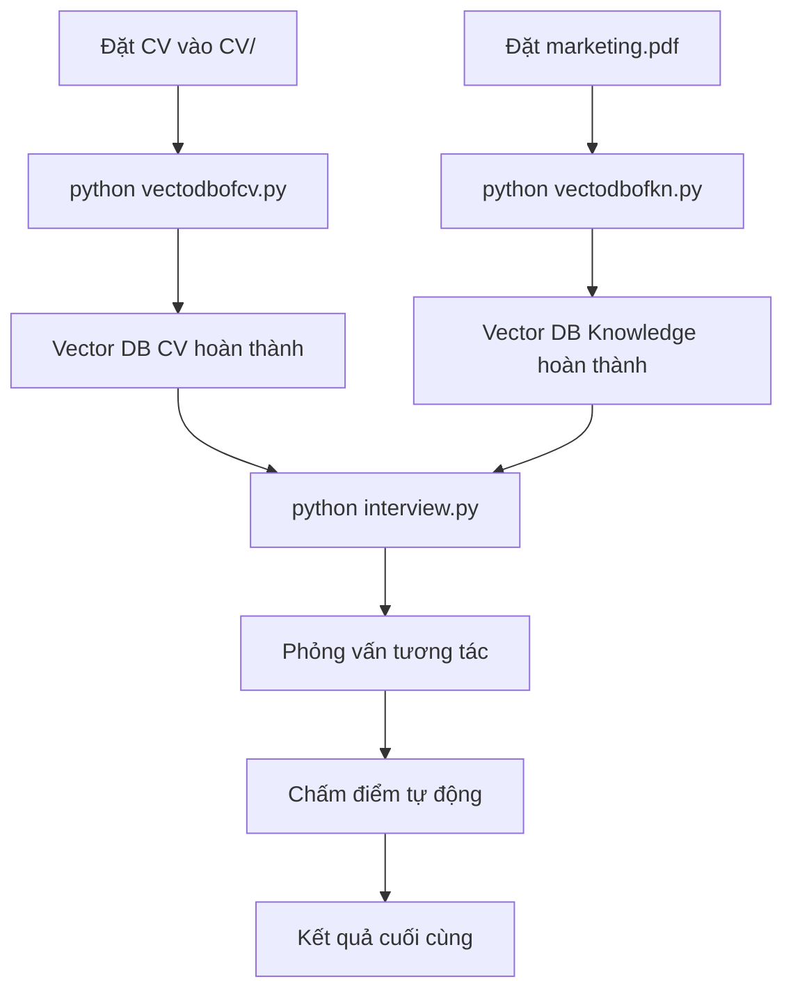

# 🎯 Hệ Thống Phỏng Vấn Thông Minh với AI

Hệ thống phỏng vấn tự động sử dụng AI để tạo câu hỏi và chấm điểm dựa trên CV của ứng viên và kiến thức kỹ thuật. Hệ thống sử dụng RAG (Retrieval-Augmented Generation) với 2 vector database để đảm bảo câu hỏi chính xác và liên quan.

## 📋 Tổng Quan Hệ Thống

### 🎯 Mục Tiêu
- Tạo câu hỏi phỏng vấn thông minh từ CV và kiến thức kỹ thuật
- Chấm điểm tự động theo 5 tiêu chí chuyên nghiệp
- Đảm bảo tính liên quan và logic giữa các câu hỏi
- Hỗ trợ đánh giá toàn diện ứng viên

### 🏗️ Kiến Trúc Hệ Thống

```
📁 Project Structure
├── 📄 interview.py              # Hệ thống phỏng vấn chính
├── 📄 generate_questions.py     # Tạo câu hỏi từ CV (legacy)
├── 📄 vectodbofcv.py           # Tạo vector DB từ CV
├── 📄 vectodbofkn.py           # Tạo vector DB từ knowledge
├── 📄 RAGtest.py               # Test RAG system
├── 📄 GetApikey.py             # Quản lý API key
├── 📁 CV/                      # Thư mục chứa CV (ảnh/PDF)
├── 📁 vector_db_cv/            # Vector database từ CV
├── 📁 vector_db2chunk_nltk/    # Vector database từ knowledge
├── 📁 outputs/                 # Kết quả output
└── 📄 marketing.pdf            # Tài liệu kiến thức kỹ thuật
```

### 🔧 Công Nghệ Sử Dụng

- **AI/ML**: Google Gemini 2.5 Flash, HuggingFace Embeddings
- **Vector Database**: FAISS (Facebook AI Similarity Search)
- **Text Processing**: NLTK, Tesseract OCR
- **Language**: Python 3.8+
- **Framework**: LangChain

## 🚀 Hướng Dẫn Cài Đặt

### 1. Cài Đặt Dependencies

```bash
pip install -r requirements.txt
```

### 2. Cài Đặt Tesseract OCR

**Windows:**
```bash
# Tải và cài đặt từ: https://github.com/UB-Mannheim/tesseract/wiki
# Thêm vào PATH hoặc set biến môi trường TESSERACT_CMD
```

**Linux:**
```bash
sudo apt-get install tesseract-ocr
```

**macOS:**
```bash
brew install tesseract
```

### 3. Cấu Hình API Key

Tạo file `.env` trong thư mục gốc:
```env
GEMINI_API_KEY=your_gemini_api_key_here
```

## 📝 Thứ Tự Chạy File

### Bước 1: Chuẩn Bị Dữ Liệu

#### 1.1. Đặt CV vào thư mục CV/
```bash
# Đặt các file CV (ảnh PNG/JPG hoặc PDF) vào thư mục CV/
# Ví dụ: CV/2.png, CV/cv.pdf
```

#### 1.2. Chuẩn Bị Tài Liệu Kiến Thức
```bash
# Đặt file marketing.pdf (hoặc file kiến thức khác) vào thư mục gốc
# File này sẽ được sử dụng để tạo câu hỏi kỹ thuật
```

### Bước 2: Tạo Vector Database

#### 2.1. Tạo Vector DB từ CV
```bash
python vectodbofcv.py
```
**Chức năng:**
- OCR CV từ ảnh trong thư mục CV/
- Chia nhỏ text thành chunks
- Tạo embeddings và lưu vào `vector_db_cv/`

#### 2.2. Tạo Vector DB từ Knowledge
```bash
python vectodbofkn.py
```
**Chức năng:**
- Đọc file marketing.pdf
- Chia nhỏ thành chunks với NLTK
- Tạo embeddings và lưu vào `vector_db2chunk_nltk/`

### Bước 3: Test Hệ Thống (Tùy Chọn)

#### 3.1. Test RAG System
```bash
python RAGtest.py
```
**Chức năng:**
- Test khả năng truy vấn vector database
- Chat với knowledge base
- Nhấn 'Esc' hoặc gõ 'exit' để thoát

### Bước 4: Chạy Hệ Thống Phỏng Vấn

#### 4.1. Phỏng Vấn Chính
```bash
python interview.py
```

**Quy trình:**
1. **Tạo câu hỏi:** Hệ thống tự động tạo 8 câu hỏi:
   - 2 câu hành vi (từ CV)
   - 3 câu kỹ thuật (từ knowledge)
   - 2 câu dự án (từ CV)
   - 1 câu sáng tạo (kết hợp cả 2)

2. **Phỏng vấn tương tác:**
   - Hiển thị từng câu hỏi
   - Thu thập câu trả lời
   - Chấm điểm tự động bằng Gemini

3. **Điều kiện câu sáng tạo:**
   - Chỉ hiển thị khi tổng điểm ≥ 8/10

4. **Kết quả cuối:**
   - Tổng điểm và đánh giá
   - Chi tiết từng câu hỏi

## 🎯 Tính Năng Chính

### 📊 Hệ Thống Chấm Điểm

Hệ thống chấm điểm theo 5 tiêu chí (mỗi tiêu chí 2 điểm):

1. **Độ chính xác (Correctness)**: Lập luận gắn kết với ý chính
2. **Độ bao quát (Coverage)**: Tỷ lệ ý chính được đề cập
3. **Lý luận (Reasoning)**: Phân tích từng bước, nêu giả định
4. **Tính sáng tạo (Creativity)**: Giải pháp mới mẻ nhưng hợp lý
5. **Truyền đạt (Communication)**: Ngôn ngữ rõ ràng, có cấu trúc

### 🔗 Tính Liên Quan Câu Hỏi

- **Behavioral**: Làm việc nhóm ↔ Xử lý thách thức
- **Technical**: Kiến thức lập trình ↔ Framework ↔ Best practices
- **CV-based**: Dự án ↔ Kinh nghiệm
- **Creative**: Kết hợp kiến thức từ cả 2 database

### 🎨 Câu Hỏi Sáng Tạo

- Chỉ hiển thị khi điểm ≥ 8/10
- Kết hợp kiến thức từ CV và technical knowledge
- Kiểm tra khả năng giải quyết vấn đề và tư duy phản biện

## 📁 Cấu Trúc Output

```
outputs/
├── cv_extracted_text.txt       # Text đã OCR từ CV
└── *.questions.json           # Câu hỏi được tạo (legacy)

vector_db_cv/
├── index.faiss                # FAISS index từ CV
└── index.pkl                  # Metadata từ CV

vector_db2chunk_nltk/
├── index.faiss                # FAISS index từ knowledge
└── index.pkl                  # Metadata từ knowledge
```

## ⚠️ Lưu Ý Quan Trọng

### Yêu Cầu Hệ Thống
- Python 3.8+
- RAM: Tối thiểu 4GB (khuyến nghị 8GB+)
- Disk: 2GB trống cho vector database
- Internet: Cần kết nối để sử dụng Gemini API

### Xử Lý Lỗi Thường Gặp

1. **Lỗi Tesseract:**
   ```bash
   # Kiểm tra cài đặt Tesseract
   tesseract --version
   # Set biến môi trường nếu cần
   export TESSERACT_CMD=/path/to/tesseract
   ```

2. **Lỗi API Key:**
   ```bash
   # Kiểm tra file .env
   cat .env
   # Đảm bảo GEMINI_API_KEY được set đúng
   ```

3. **Lỗi Vector Database:**
   ```bash
   # Xóa và tạo lại vector database
   rm -rf vector_db_cv/ vector_db2chunk_nltk/
   python vectodbofcv.py
   python vectodbofkn.py
   ```

## 🔄 Quy Trình Hoàn Chỉnh



## 📞 Hỗ Trợ

Nếu gặp vấn đề, hãy kiểm tra:
1. Các file vector database đã được tạo
2. API key Gemini hợp lệ
3. Dependencies đã được cài đặt đầy đủ
4. File CV và knowledge có định dạng hỗ trợ

## 📄 License

Dự án này được phát triển cho mục đích học tập và nghiên cứu.

---

**🎯 Hệ thống phỏng vấn thông minh - Tương lai của tuyển dụng!**
